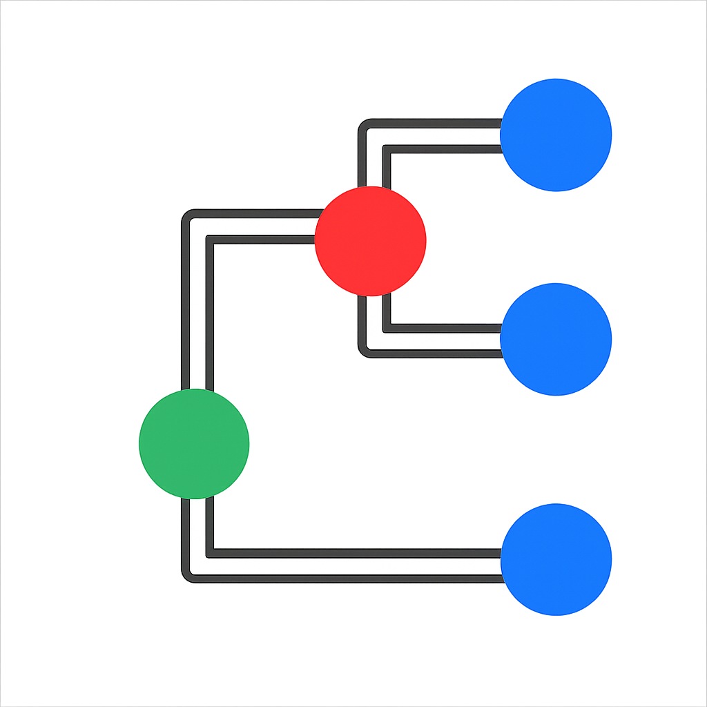

<p align="center">
  
</p>

<h1 align="center">Treemble</h1>

> Important: Installers for macOS and Windows are available at https://treemble.org. This repository exists to make the source code publicly available and is not the primary distribution channel.

Treemble is a cross-platform desktop application built with Tauri + React. For a full feature overview, documentation, quick start guides, and FAQs, please visit https://treemble.org.

## Download

Get the latest signed installers for macOS and Windows from:
- https://treemble.org

## Build from source

While most users should download installers from the website, you can build Treemble locally if you prefer.

### Prerequisites
- Node.js 18+ and pnpm
- Rust (stable) and the platform toolchain
- Tauri prerequisites for your OS:
  - macOS: Xcode Command Line Tools
  - Windows: Visual Studio Build Tools (Desktop development with C++)
  - Linux: system libs per Tauri docs
  - See https://tauri.app/start/prerequisites/

### Steps
```bash
pnpm install

# Run in development (Tauri + Vite)
pnpm tauri dev

# Build web assets and bundle native installers
pnpm bundle
```

For additional help, see Tauri docs: https://tauri.app

